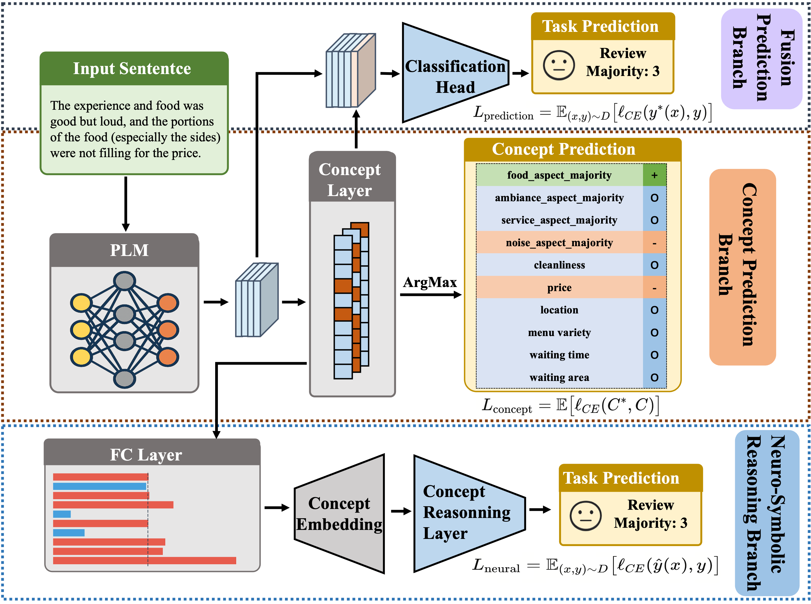
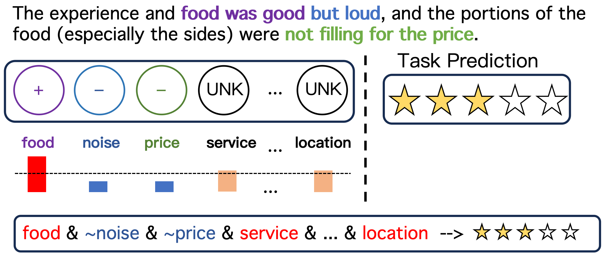

# CLMN: Concept based Language Models via Neural Symbolic Reasoning

This repository contains the implementation of **Concept Language Model Network (CLMN)**, a novel neural-symbolic framework designed to reconcile performance and interpretability in Natural Language Processing (NLP).

## 📖 Overview

Deep learning models in NLP often function as "black boxes," limiting their adoption in high-stakes domains like healthcare and finance where transparency is essential. While Concept Bottleneck Models (CBMs) have been successful in Computer Vision, their adaptation to NLP often suffers from information loss due to rigid binary concepts or obscured semantics.

<br>

<br>

**CLMN** addresses these limitations by:

1.  **Continuous Concept Embeddings:** Projecting concepts into an interpretable space while preserving semantic information.

2.  **Neural-Symbolic Reasoning:** Utilizing fuzzy logic-based reasoning to model dynamic concept interactions (e.g., negation, contextual modification).

3.  **Joint Training:** Supplementing original text features with concept-aware representations to achieve superior performance.

As shown above, the input sentence is processed by a PLM. The Concept Layer predicts specific aspects (e.g., food, service), which are then fed into a Concept Reasoning Layer (using fuzzy logic) and combined with the PLM's features for the final sentiment prediction.

## 🛠️ Requirements

- Python 3.8+
- PyTorch
- Transformers (Hugging Face)
- Gensim (for FastText if using LSTM)
- Datasets
- Scikit-learn
- Pandas
- Tqdm

## 📂 Dataset

The project utilizes an augmented version of the **CEBaB** dataset, referred to as **aug-CEBaB-yelp**.

- **Source:** Includes human-annotated concepts (Food, Ambiance, Service, Noise).

- **Augmentation:** Uses ChatGPT to generate additional concepts (e.g., Cleanliness, Price, Menu Variety) and assign noisy labels to unlabeled Yelp reviews.

- **Structure:** Each concept is classified as Positive, Negative, or Unknown.

## 🚀 Usage

### 1. Configuration

The main training parameters are defined at the top of the script. Key hyperparameters used in the paper include:

- `max_len`: 512

- `num_epochs`: 25

- `batch_size`: 8

- `concept_loss_weight` (\alpha_1): 100

- `y2_weight` (\alpha_2): 10

### 2. Supported Backbones

You can switch between different backbone models by modifying the `model_name` variable in the code:

- `bert-base-uncased`
- `roberta-base`
- `gpt2`
- `lstm` (Uses FastText embeddings)

### 3. Training

To train the model in the joint mode (Concept + Task prediction):

```python
# In the script, ensure:
mode = 'joint'
data_type = "aug_cebab_yelp"

# Run the script
python train_clmn.py

```

The training loop optimizes a combined objective function:

where the model learns to predict the final label, the intermediate concepts, and the neural-symbolic reasoning rules simultaneously.

## 📊 Performance & Results

CLMN demonstrates that interpretability does not require sacrificing accuracy. Extensive experiments show that CLMN outperforms existing concept-based methods in both accuracy and explanation quality.

### Backbone Comparison

Performance comparison on the aug-CEBaB-yelp dataset:

| Backbone    | O-Acc (Original) | O-F1  | CLMN C-Acc (Concept) | CLMN R-F1 (Reasoning) |
| ----------- | ---------------- | ----- | -------------------- | --------------------- |
| **BERT**    | 69.49            | 79.72 | 85.85                | 76.49                 |
| **RoBERTa** | 80.92            | 71.21 | 86.09                | 76.51                 |
| **GPT-2**   | 75.39            | 63.39 | 85.18                | 75.76                 |
| **LSTM**    | 65.65            | 47.54 | 66.60                | 57.10                 |

### Interpretability Visualization

CLMN provides transparent explanations by explicitly deriving the logic behind predictions.

In the example:

1.  **Concept Extraction:** The model identifies "food was good" (Positive Food) and "loud" (Negative Noise).

2.  **Reasoning:** It constructs a logical rule: `food & ~noise & ~price...` to determine the final sentiment.

3.  **Result:** This derivation process allows users to verify _why_ the model assigned a specific rating, addressing the trust issues in black-box models.

<br>

<br>

## 🔗 Citation

If you use this code or findings in your research, please cite the paper:

> **CLMN: Concept based Language Models via Neural Symbolic Reasoning**
> Yibo Yang.
