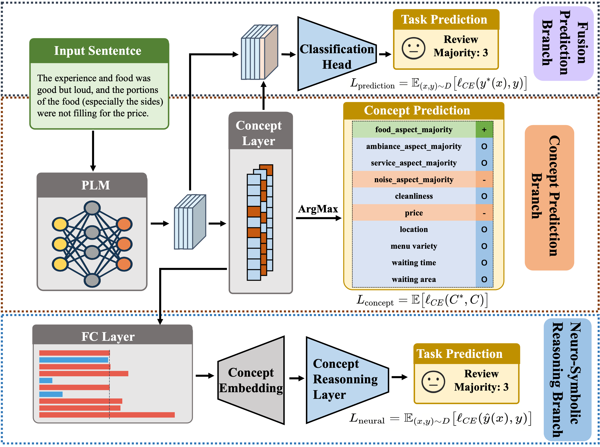
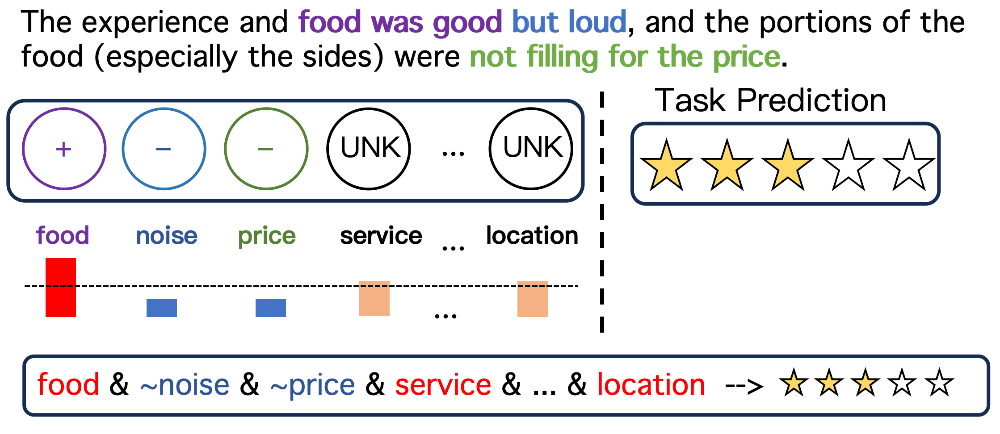

<div align="center">

# CLMN

### Concept-based Language Models via Neural Symbolic Reasoning

[](https://arxiv.org/abs/2510.10063)
[](https://www.python.org/)
[](https://pytorch.org/)
[](LICENSE)

<br>

*Bridging **Performance** and **Interpretability** in NLP through Neural-Symbolic Reasoning*

---

</div>

> Deep learning models in NLP often function as **"black boxes"**, limiting their adoption in high-stakes domains like healthcare and finance where transparency is essential. **CLMN** is a novel neural-symbolic framework that reconciles performance and interpretability — achieving state-of-the-art accuracy while providing human-readable logical explanations for every prediction.

<br>

## Table of Contents

- [Architecture](#-architecture)
- [Key Features](#-key-features)
- [Quick Start](#-quick-start)
- [Dataset](#-dataset)
- [Usage](#-usage)
- [Results](#-results)
- [Interpretability](#-interpretability)
- [Citation](#-citation)

<br>

## Architecture

<div align="center">

<br><br>
<em>The input sentence is processed by a PLM. The Concept Layer predicts specific aspects (e.g., food, service), which are then fed into a Concept Reasoning Layer (using fuzzy logic) and combined with the PLM's features for the final sentiment prediction.</em>
</div>

<br>

## Key Features

<table>
<tr>
<td width="33%" align="center">
<br>
<h3>Continuous Concept Embeddings</h3>
Projects concepts into an interpretable space while <b>preserving semantic information</b> — no information loss from rigid binary bottlenecks.
<br><br>
</td>
<td width="33%" align="center">
<br>
<h3>Neural-Symbolic Reasoning</h3>
Utilizes <b>fuzzy logic-based reasoning</b> to model dynamic concept interactions — negation, contextual modification, and more.
<br><br>
</td>
<td width="33%" align="center">
<br>
<h3>Joint Training</h3>
Supplements original text features with <b>concept-aware representations</b> to achieve superior performance without sacrificing interpretability.
<br><br>
</td>
</tr>
</table>

<br>

## Quick Start

```bash
# Clone the repository
git clone https://github.com/YourUsername/CLMN.git
cd CLMN

# Install dependencies
pip install torch transformers gensim datasets scikit-learn pandas tqdm

# Train the model (joint mode with BERT backbone)
cd run_cebab
python cbm_joint.py
```

<br>

## Dataset

The project utilizes an augmented version of the **CEBaB** dataset, referred to as **aug-CEBaB-yelp**.

| Property | Details |
|:---|:---|
| **Source** | Human-annotated concepts: Food, Ambiance, Service, Noise |
| **Augmentation** | ChatGPT-generated concepts: Cleanliness, Price, Menu Variety, etc. |
| **Labels** | Each concept classified as `Positive`, `Negative`, or `Unknown` |
| **Base Data** | Yelp restaurant reviews |

<br>

## Usage

### Configuration

Key hyperparameters used in the paper:

```python
max_len            = 512
num_epochs         = 25
batch_size         = 8
concept_loss_weight = 100   # α₁
y2_weight          = 10     # α₂
```

### Supported Backbones

| Backbone | Model Name | Notes |
|:---|:---|:---|
| BERT | `bert-base-uncased` | Default, best overall |
| RoBERTa | `roberta-base` | Highest original accuracy |
| GPT-2 | `gpt2` | Autoregressive baseline |
| LSTM | `lstm` | Uses FastText embeddings |

### Training

```python
# In the script, set:
mode = 'joint'
data_type = "aug_cebab_yelp"
model_name = "bert-base-uncased"  # or roberta-base, gpt2, lstm
```

```bash
cd run_cebab
python cbm_joint.py
```

<br>

## Results

CLMN demonstrates that **interpretability does not require sacrificing accuracy**. Extensive experiments show CLMN outperforms existing concept-based methods in both accuracy and explanation quality.

<div align="center">

### Performance on aug-CEBaB-yelp

| Backbone | O-Acc | O-F1 | C-Acc (Concept) | R-F1 (Reasoning) |
|:---:|:---:|:---:|:---:|:---:|
| **BERT** | 69.49 | 79.72 | 85.85 | 76.49 |
| **RoBERTa** | **80.92** | 71.21 | **86.09** | **76.51** |
| **GPT-2** | 75.39 | 63.39 | 85.18 | 75.76 |
| **LSTM** | 65.65 | 47.54 | 66.60 | 57.10 |

</div>

<br>

## Interpretability

CLMN provides **transparent, human-readable explanations** by explicitly deriving the logic behind every prediction:

```
Step 1  Concept Extraction    →  "food was good" (✅ Positive Food)
                                  "loud"          (❌ Negative Noise)

Step 2  Logical Reasoning     →  food ∧ ¬noise ∧ ¬price ...

Step 3  Final Prediction      →  ★★★★ (4/5 rating)
```

This derivation process allows users to verify *why* the model assigned a specific rating, addressing the trust issues inherent in black-box models.

<div align="center">

<br><br>
<em>Example of CLMN's interpretable reasoning pipeline on a restaurant review.</em>
</div>

<br>

## Citation

If you use this code or findings in your research, please cite:

```bibtex
@article{yang2025clmn,
  title   = {CLMN: Concept based Language Models via Neural Symbolic Reasoning},
  author  = {Yang, Yibo},
  journal = {arXiv preprint arXiv:2510.10063},
  year    = {2025}
}
```

---

<div align="center">

**Made with passion for interpretable AI**

</div>
